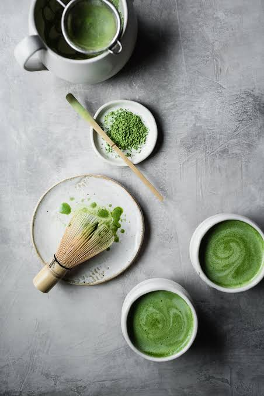

Markdown
# How to Make Matcha

Matcha is a Japanese green tea made by grinding specially grown tea leaves into a fine powder. Unlike traditional tea, matcha powder is mixed directly into water, allowing the entire tea leaf to be consumed. Preparing matcha is a simple process that requires only a few materials and can be completed in a few minutes.

### WARNING: May get addicted to matcha!

## Required Materials

- Matcha powder
- Matcha bowl or small bowl
- Bamboo matcha whisk
- Small spoon or matcha scoop
- Hot water
- Measuring cup
- Milk (optional)
- Sweetener (optional)

## Steps

1. **Heat the water**
   - Heat approximately 2–3 ounces of water.
   - Allow the water to cool slightly after boiling. The water should be hot but not boiling.

2. **Prepare the matcha bowl**
   - Place the matcha bowl on a flat, stable surface.
   - Soak the bamboo whisk in warm water for a few seconds to soften the bristles.

3. **Measure the matcha**
   - Add 1–2 teaspoons of matcha powder to the bowl.
   - Use a small sifter to remove any clumps from the powder.
   > Sifting the matcha will make it easier to whisk and create a smoother drink.

4. **Add the water**
   - Pour approximately 2–3 ounces of hot water into the bowl with the matcha.

5. **Whisk the matcha**
   - Hold the bowl firmly with one hand.
   - Use the bamboo whisk with your other hand.
   - Move the whisk quickly back and forth in a "W" or "M" motion.
   - Continue whisking until the matcha becomes smooth and a layer of foam forms on the surface.
   - Avoid pressing the whisk firmly against the bottom of the bowl. Use quick, light movements instead.

6. **Check the consistency**
   - Make sure there are no visible clumps of matcha powder.
   - If the matcha is too thick, add a small amount of hot water and whisk again.

7. **Add milk (optional)**
   - For a matcha latte, heat approximately 6–8 ounces of milk.
   - Slowly pour the milk into the prepared matcha.
   - Stir gently until the milk and matcha are combined.

8. **Add sweetener (optional)**
   - Add honey, sugar, or another sweetener according to your preference.
   - Stir until the sweetener is completely dissolved.

9. **Serve the matcha**
   - Pour the prepared matcha into a cup if desired.
   - Serve immediately while the drink is warm.

10. **Clean the equipment**
    - Rinse the matcha bowl and whisk with warm water.
    - Gently clean the bamboo whisk without using soap.
    - Allow the whisk and other equipment to air dry before storing them.
